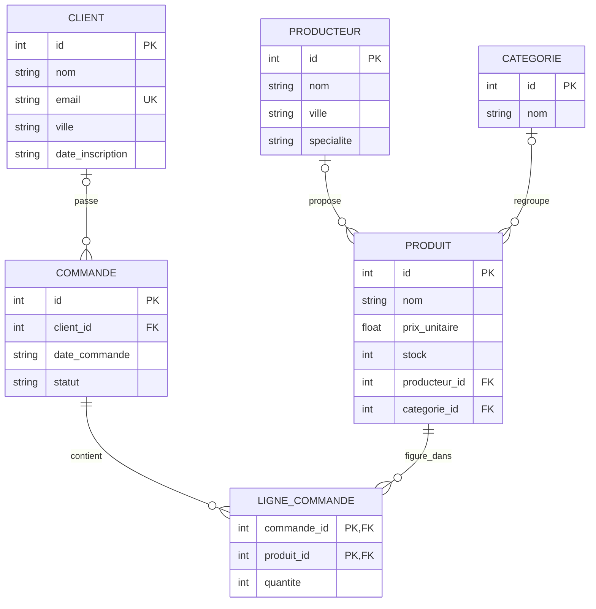

# Le Panier Fermier — Schéma des données
# mermaid

```mermaid
erDiagram
    
    
    PRODUCTEUR {
        int id PK
        string nom
        string ville
        string specialite
    }
    PRODUIT {
        int id PK
        string nom
        float prix_unitaire
        int stock
        int producteur_id FK
        int categorie_id FK
    }

    CLIENT {
        int id PK
        string nom
        string email UK
        string ville
        string date_inscription
    }

    COMMANDE {
        int id PK
        int client_id FK
        string date_commande
        string statut
    }

    LIGNE_COMMANDE {
        int commande_id PK,FK
        int produit_id PK,FK
        int quantite
    }

        CATEGORIE {
        int id PK
        string nom
    }

    PRODUCTEUR |o--o{ PRODUIT : propose
    CLIENT |o--o{ COMMANDE : passe
    COMMANDE ||--o{ LIGNE_COMMANDE : contient
    PRODUIT ||--o{ LIGNE_COMMANDE : figure_dans
    CATEGORIE|o--o{ PRODUIT : regroupe
```

